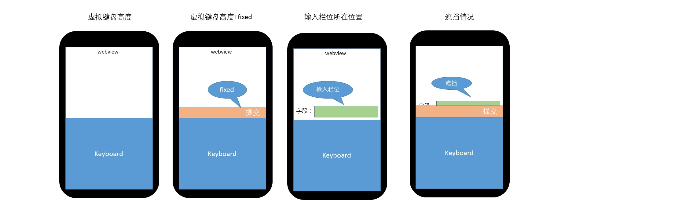

# android 键盘遮挡问题

## 关于 fixed 分析

`position:fixed; bottom:0;`的元素在唤起虚拟键盘的时候会被键盘顶到虚拟键盘的上边，其中原因是：android 在唤起虚拟键盘的时候，会讲 webview 的窗口的高度缩小（原来的高度-虚拟键盘的高度），所以`position:fixed; bottom:0;`的元素被顶上去的原因不是 css 兼容性问题，是 android 调整浏览器（webview）窗口问题。

## android webview 处理输入聚焦问题

在唤起虚拟键盘的时，android 操作系统会自动判断当前的输入框所在位置是否会被虚拟键盘覆盖，**如果检测到会被覆盖，会自动将输入框调整到当前窗口的居中位置**。**如果检测到不会被覆盖，系统不会调整输入框在当前窗口的位置。**

因此常规情况下，点击输入框定位问题，android 操作系统已经做了处理。

## 输入框遮挡原因分析

那为什么我们的程序会出现遮挡情况，原因是输入框的位置刚好卡在键盘高度与 键盘高度+fixed 元素之间。（从底部向上计算）

## 解决思路

根据上面的原因分析，当元素在这个位置的情况下，点击元素的是将元素的位置上移 fixed 元素的高度。

## demo 测试

1. 先在任何一个输入框中点击键盘，然后再 vConsole 中看到键盘的高度。

2. 手动修改 fixed.html 的`window.keyboardHeight=？`，`？`是键盘的高度.

3. 重新加载 fixed.html 滚动页面将`input2`元素移动到: 键盘高度和键盘高度+fixed 的情况。

4. 点击`input2`输入框测试
